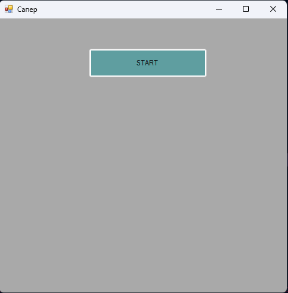
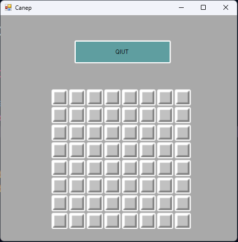
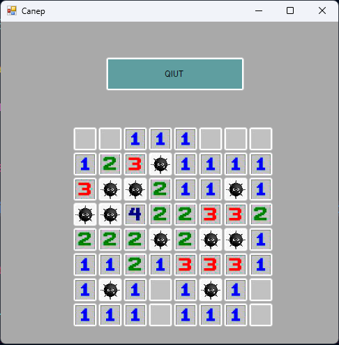

# Minesweeper

> This Game I create on C# with WinForm.

> The objective of Minesweeper is to clear a rectangular grid containing hidden mines or bombs without detonating any of them. The numbers on the grid indicate how many mines are adjacent to each square, and you must use logic and deduction to determine where the mines are located. The game requires careful thinking and strategy to avoid the mines and successfully clear the entire grid.

## Start Game

## Create Map Game

## Visible Map

